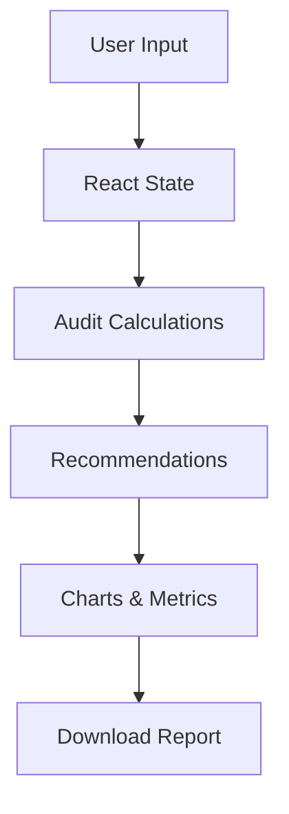

# Architecture

## Data Flow

Users enter AI tool spending and team size information.

The application processes this data using audit logic and generates:
- savings recommendations
- efficiency score
- charts
- downloadable reports

## Stack Choice

- Next.js for frontend rendering
- React for UI management
- TailwindCSS for styling
- Recharts for visualization

## Scaling to 10k audits/day

If scaled:
- add PostgreSQL database
- add authentication
- move calculations to backend APIs
- cache frequent reports
